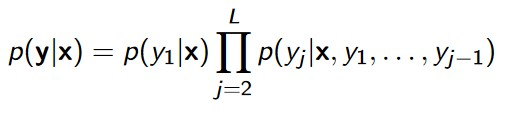
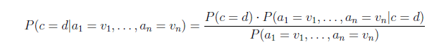

# **Dokumentacja wstępna ZUM**

*Autorzy: Wojciech Makos, Jakub Kliszko*

## Temat:  
Tworzenie modeli klasyfikacji wieloetykietowej przez zastosowanie dekompozycji na wiele powiązanych zadań klasyfikacji jednoetykietowych zgodnie z metodą bayesowskiego łańcucha klasyfikatorów. Porównanie z algorytmami klasyfikacji wieloetykietowej dostępnymi w środowisku R lub Python. (Bayes classifier chain for multi-label classification)

### 1. Interpretacja tematu projektu

Głównym celem projektu jest implementacja algorytmu służącego do klasysyfikacji przykładów posiadających więcej niż jedną etykietę. Każdy przykład ma przypisany zestaw binarnych znaczników. Jednym ze sposobów stworzenia modelu umożliwiającego predykcje na bazie przykładów wieloetykietowych jest dokonanie tranformacji tej bazy zgodnie z metodą łańcucha klasyfikatorów. Metoda ta polega na sekwencyjnym (czyli w kolejności) tworzeniu modeli klasyfikacji binarnej, w której to dla każdego kolejnego modelu dodaje się do zbioru atrybutów predykcje etykiet poprzednich modeli wykorzystanych przy wcześniej rozważanych etykietach. Innymi słowy dla przykładu składającego się z wektora atrybutów X = (x1, x2, x3) i etykiet Y = (y1, y2), pierwszy model tworzymy dla przykładu składającego się jedynie z wektora atrybutów X = (x1, x2, x3) i etykiety Y = (y1). Model przewiduje nam wartość y1. W kolejnym podejściu tworzymy drugi model, tym razem już dla przykładu składającego się z wektora atrybutów X = (x1, x2, x3, y1) i etykiety Y = (y2). Analityczny opis tej metody wygląda następująco:

Kolejność predykcji następujących po sobie etykiet jest istotna i ma wpływ na końcowy wynik, zatem w testach modelu postaramy się zbadać wpływ kolejności etykiet na wynik klasyfikacji dla konkretnych przykładów. Wybranym klasyfikatorem dla każdego z modeli będzie naiwny klasyfikator bayesowski.

### 2. Opis części implementacyjnej oraz lista algorytmów, bibliotek, klas, funkcji

Projekt będzie realizowany w języku Python. Poniżej przedstawiono poszczególne etapy implementacji:

#### 2.1 Przygotowanie danych 
W tym etapie wczytane zostaną przykłady z plików o rozszerzeniu .arff. Następnie dane te zostaną przejrzane oraz dokonana zostanie ich wstępna analiza w celu np. znalezienia i wyeliminowania przykładów z brakującymi wartościami. Po wstępnej analizie dane zostaną podzielone na 2 części - zestaw atrybutów oraz zestaw etykiet. Operacja ta będzie możliwa dzięki zaimplementowaniu klasy Data dziedziczącej z klasy NamedTuple. Cała realizacja odbędzie się w ramach metody read_rada().

#### 2.2 Preprocessing danych
Kolejnym etapem projektu będzie przekształcenie danych w taki sposób, aby miały one odpowiedni format i były gotowe do bezpośredniego przekazania modelu klasyfikacji. Zostanie zaimplementowana funkcja split_data(), która podzieli dane na zbiór treningowy i testowy we wspomnianej proporcji 4:1. Funkcja ta będzie zwracać 2 zestawy danych. Następnie przewiduje się konwersję danych kategorycznych na wersję numeryczną za pomocą enkodera (prawdopodobnie wybranym enkoderem bedzie OneHotEncoder(), którego użyjemy korzystając z sklearn).

#### 2.3 Budowa klasyfikatorów jednoetykietowych
Klasyfikatorami jednoetykietowymi będą naiwne klasyfikatory bayesowskie, które planujemy zaimplementować klasę NaiveBayes, w której pojawią się takie metody jak fit() - uczenie modelu, predict() - predykcja modelu. Naiwny klasyfikator bayesowski bazuje na wyznaczaniu prawdopodobieństwa przynależności do danej klasy na podstawie prawdopodobieństwa przynależności do danej klasy poszczególnych atrybutów. Klasyfikator Bayesa bazuje bezpośrednio na twierdzeniu Bayesa, z którego można wyliczyć prawdopodobieństwo warunkowe zaistnienia pewnego zdarzenia, pod warunkiem zajścia innego zdarzenia:

gdzie *a* to zestaw cech, *c* to badana hipoteza, czyli etykieta. *P(c=d)* to prawdopodobieństwo a'priori, *P(c=d|a1=v1,...,an=vn)* to prawdopodobieństwo a'posterioi. Warto zauważyć, że klasyfikator bayesowski zakłada niezależność cech, która to obrazuje się następującym wzorem:

Powyższy zabieg jest oczywiście uproszczeniem, ale w praktyce sprawdza się w wielu przypadkach.
Przy implementacji klasyfikatora Bayesa zastosujemy również wygładzanie laplace'a z możliwością zmiany parametru alpha.

#### 2.4 Implementacja łańcucha klasyfikatorów
W tym etapie zaimplementujemy łańcuha klasyfikatorów, który będzie składał się z klasy ClassifierChain. W tej klasie zaimplementujemy metody fit(), która to bedzie wywoływać w pętli metody klasy *NaiveBayes* oraz predict(). W metodzie fit() będziemy tworzyć kolejne modele klasyfikacji binarnej, a w metodzie predict() będziemy przewidywać etykiety dla kolejnych modeli. W klasie ClassifierChain zrealizujemy w ten sposób, aby można było przekazać kolejność etykiet, dla których chcemy przewidywać wartości. 

#### 2.6 Testowanie modelu
#### 2.7 Analiza wyników

### 3. Plan badań - testowanie modelu:
   - #### Cel badań,

Z racji na implementacyjny charakter projektu postanowiliśmy zbadać i zweryfikowac jedynie podstawowe czynniki i parametry modelu mogące mieć wpływ na ostateczne wyniki klasyfikacji. Planujemy wyznaczyć: 
   - dokładność wyników klasyfikacji dla przynajmniej 2 zestawów danych testowych, 
   - czas uczenia modelu,,
   - wpływ kolejności etykiet na wynik klasyfikacji,
   - wpływ zmiany stosunku podziału na wynik klasyfikacji,
   - wpływ .... na wynik klasyfikacji,
   
   
   - #### Charakterystyka zbioru danych:
Zdecydowano się na wybór danych do testowania modeli z portalu UCI Machine Learning Repository. https://archive.ics.uci.edu/dataset/528/amphibians
Zbiór danych zawiera 189 przykładów, 22 atrybuty oraz 4 etykiety. Zbiór danych zawiera informacje o płazach i pochodzi z portalu GIS oraz informacji satelitarnych, a także z informacji zebranych z inwentaryzacji przyrodniczych w Polsce. Atrybuty każdego przykładu opisują środowisko przyrodnicze danej okolicy, np. liczba zbiorników wodnych w okolicy, typ zbiorników, obecność podmokłych łąk, stawów, itp. Etykiety opisują z kolei gatunki płazów, które występują w danej okolicy; każda etykieta odpowada osobnemu gatunkowi płaza. Zbiór danych nie zawiera brakujących wartości. Składa się z atrubutów numerycznych, porządkowych, a także kategorycznych.

Jako drugi zestaw danych wybrano również dane o podłożu biologiczno-przyrodniczym: https://archive.ics.uci.edu/dataset/406/anuran+calls+mfccs. 
Dane umożliwiają rozpoznawanie gatunków anuranów(żab) na podstawie dzięków, które wydają. Ten zestaw danych został utworzony na podstawie segmentacji 60 nagrań audio należących do 4 różnych rodzin, 8 rodzajów i 10 gatunków. Każdy dźwięk odpowiada jednemu okazowi. Dane składają się z ponad 7000 przykładów. Każdy przykład posiada 3 etykiety określające gatunek, rodzaj i rodzinę płazów. Przykłądy skłądają się z 22 atrybutów - współczynników MFCC, które to są wynikami analizy sygnału dźwiękowego. Podane dane mają charakter numeryczny

  - #### Procedura ocenu modeli 
Przede wszystkim planujemy wyznaczyć dokładność predykcji modelu. W tym celu wybrany zbiór danych zostanie podzielony na zbiór treningowy i testowy, nastepnie wytrenowany na zbiorze treningowym, a wyniki klasyfikacji zostaną porównane z etykietami zbioru testowego. Tą samą operację zamierzamy przeprowadzić dla obu zbiorów danych, a dokładność wyników porównać ze sobą i zestawić w tabeli zbiorczej. Wyniki predykcji chcielibyśmy również porównać z wynikami gotowych algorytmów, zaimplementowanych w bibliotece scikit-learn. Dodatkowo do tworzenia klasyfikatora wieloetykietowego przyda się biblioteka scikit-multilearn. Ponadto w projekcie na potrzeby przetwarzania danych planujemy wykorzystać biblioteki takie jak pandas, numpy.

   - #### Plan eksperymentów
W ramach eksperymentów planujemy przeprowadzić testy dla różnych zbiorów danych, różnych proporcji podziału na zbiór treningowy i testowy, różnych kolejności etykiet, różnych wartości parametru alpha w wygładzaniu laplace'a klasyfikatora Bayesa.

